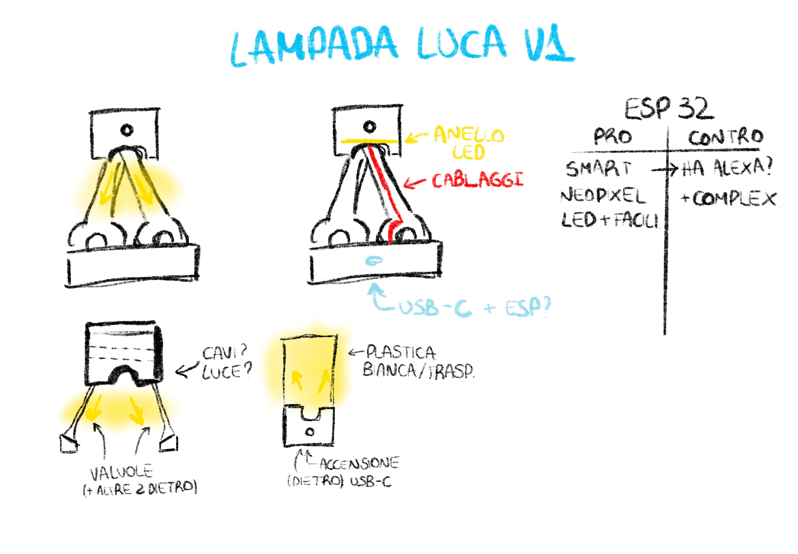
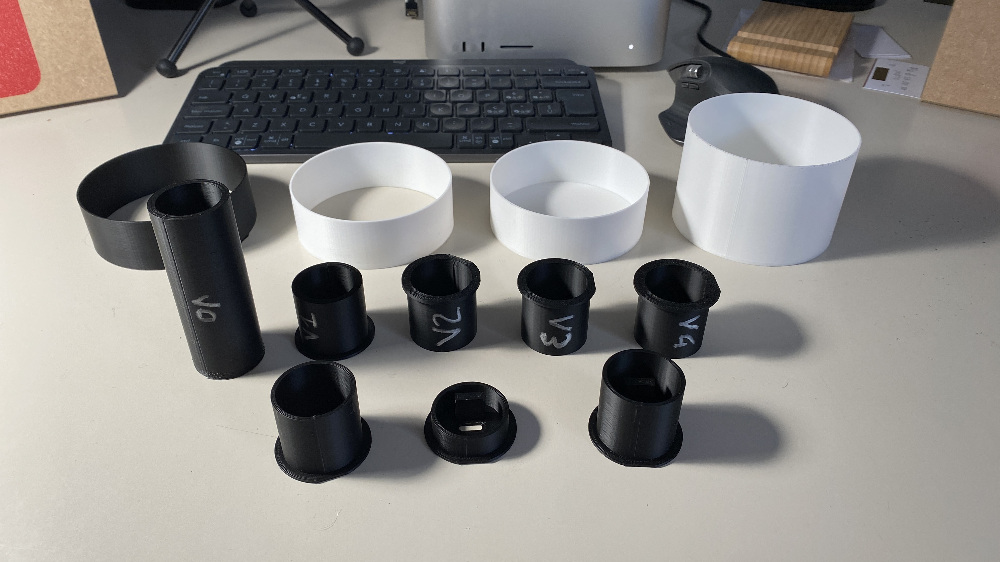
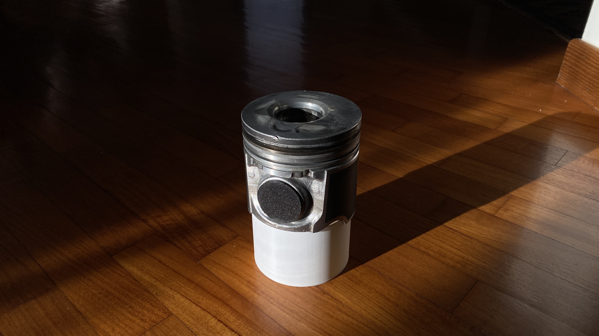
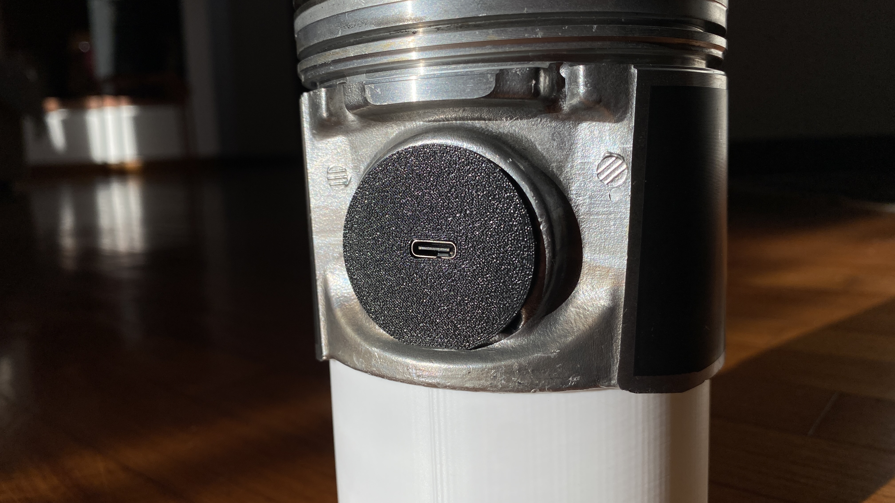
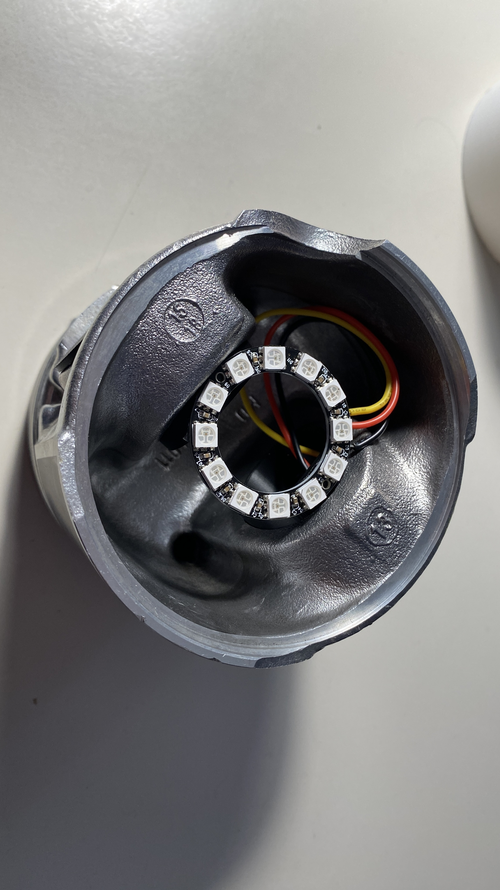

# ⚙️ PistonLamp
The complete project history of a lamp based on a piston from a car engine.

## 🎁 Context
Every year, during the Christmas period, with a group of friends from the place where I live, we organize a Secret Santa. For those who have never heard of it, you basically extract randomly someone in the group and you have to come up with a present for them. The "secret" part is the fact that you don't know who is the pearson that is going to give you a gift until the moment he or she gives it to you.
The only rules of the game are:
1. Your present must stay in a pre-defined budget (in this case it was 5€)
2. You must not tell anyone whose name you have drawn (nor try to understand whoever has dranwn your name)

This year I had to make a present for Luca, one of my closest friends who happens to be really into cars.

## 💡 The idea
Even if I know Luca really well, it's always hard to find a good gift for a person with a very restricted budget and without consulting with anyone. I kept remebering in my head that he always wanted to make a lamp out of old objects that no longer has their proper function, but it seemed too difficult of an idea to actually be realized.

That changed the moment my father, out of nowhere, told me he had to go (for work reasons) to a local company that rectifies cilinders of dead/damaged engines to bring them back to life. He also told me that they most likely had a pile of old and damaged pistons that no longer had a use. \
I had an idea for the present: if they were kind enough to give me an old piston (for free) I could put an led ring inside of it and make a lamp out of it.

## 📑 To the project board

> [!TIP] 
> From now on, I need to talk in a more technical language, specifically about the various part that are used around a piston inside the engine. I'll leave an image that explains clearly what I am talking about [here](./assets/piston_schematic.jpg).

Luckily, they were really kind and gave me a wrecked piston to make the lamp. So I quickly opened a sketching app on my iPad and drawn some ideas I had. \
One thing was sure, I wanted the light ring to be placed inside of the piston, with the light shining in the direction where the connecting rod would be. 

There are 3 different designs in the image above: the first one is explained in the first row from the top, while the others are the two drawings in the second row.

### 1️⃣ Idea #1
The first idea was the one that conviced me the most. It was supposed to have a round base where all the electronics required should have lived, while the piston was rised from the base by two custom made connecting rods placed like a sort of reversed V shape.

### 🔢 Ideas #2 and #3
The second idea was the worst one, in my opinion. To rise the piston, instead of the connecting rods, I thought about some engine valves I had laying around in my home. \
Yes, I know, "who has valves laying around in their house?". I'm building a lamp out of a piston, you should not be surprised about some valves.

Anyway, the last design I came up with was ok, but not as good as the first one. This time, the piston was placed head down on the table, with a plastic thing to diffuse light on the top. In this case, the wrist pin of the piston played a crucial role, because it was the house for the electronics, with one side closed and the other one with the hole for the USB-C connector.

## 🛠 Approach with reality
After a more detailed inspection of the piston and to which electronics I had available at home (do you remeber the 5€ budget?) I quickly understood that the first design was a lot more complicated than what I thought.

While I have a small CNC machine I can use to make the connecting rods (out of wood), the size of the led ring I found was too little "hug" the connecting rods. Also, the weight of the piston raised some concerns to me, as I didn't know whether the wood I had available was able to handle it or not.

The [third design](#third-design), suddenly, had a lot more appeal than before.
It was still not enough though, I had to make it better: with the piston head facing the table, in my opinion, it was not so clear what that metal cilindrical thing was.

What about rotating it? Eureka!

## ⚡️ The electronics and the software.
Now that I had a final design, I was ready to finalyze the hardware and the software. \

Starting from the lights (which I obviously wanted RGB), I chose a WS2812B ring (12 leds) that was a leftover from another project.

> [!NOTE] 
> A WS2812B is an addressable RGB LED that has its own tiny driver chip built in, so each LED can be controlled individually with a single data line. They’re commonly used in LED strips and matrices for colorful animations, effects, and displays.

As I said in the explanation of the third design, the only space I have in this design to house the electronics is in the wrist pin, so I need everything to be small. As if it wasn't already enough troubles, I didn't want to have a switch on the device, as it would ruin the idea of the piston. So I had to come up with something that not only was capable of driving the twelve LEDs, but it was also small and able to connect to the internet to (somehow, I didn't have an idea still) control everything.
Luckily, Aliexpress came in help and shipped me a small ESP32-C3 based microcontroller for ~3€.

Now I "just" needed to figure out the software part. I could probably code a web server on the ESP-32 to process the request for the light over Luca's house LAN but that required a lot of time that, with the university exams at the door, I really didn't have.
After thinking about this for a little longer, the [WLED project](https://kno.wled.ge) came to my mind, and it was simply perfect. I mean, just read the first line of their website:

> A fast and feature-rich implementation of an ESP32/ESP8266 webserver to control NeoPixel (WS2812B, WS2811, SK6812) LEDs [...]

Does it sound familiar?

I quickly flashed the ESP with their web flasher and a few clicks of config later I had a perfectly branded and working lamp. It was time to join the piston with the electronics.

## 💍 The marriage with the piston
For design purposes (again) I didn't want to have screws or glue in sight, and I wanted the device to be serviceable in the future.

I came up with the idea of dividing the wrist pin in two halves, one that is simply a cork and the other one that will contain the ESP32. The LED ring will be the piece that joins the two halves so that they are not able to escape the holes in the piston intended for the wrist pin (as shown in the [image below](#image-below)).

So I opened AutoCAD, and quickly (first try) created the perfect 3D model to print. Yea... 

"first try".

Once I had the piston (cleaned from all the oil and stuff), the electronics and the prints I needed putting all together was really simple:
1. Solder the three wires needed to the ESP-32 (I suggest long cables) (a red one to the 5V, a black one to the GND and a yellow one for the signal)
2. Apply double side tape on the bottom of the ESP and stick it to the supporting part of his half of the wrist pin, paying attention to the USB-C port being correctly placed in the hole
3. Put said half in one of the holes of the piston, with the flatened part (see the [model files](https://www.printables.com/model/1530696-pistonlamp)) pointing to the opposite direction from the head of the piston (it's where the LED ring will stick!)
4. Now you can solder the RED wire to the VCC pin on the ring, the BLACK one to the GND and the YELLOW one to the signal (the cables should be routed something like [this](#image-ring))
5. Put the remaining half of the wrist pin in the remaining home in the piston (with the flatened part as said before)
6. Put some double sided tape on the ring in the spots that will sit on the flatened part of the wrist pin and stick the ring to it!

## 📸 The finished result
I'll leave some pictures to let you enjoy (I hope) the finished lamp!

## 📦 Final considerations
I managed to finish the project in time for the gift exchange, and Luca really liked it! \
It also worked really great with Luca's phone using the WLED app for Android, without needing any additional configuration (other than his Wi-Fi password).

Now, let's talk a little about replicability of the project. If you manage to find the exact same piston[^1], I'll leave the .STL files [here](https://www.printables.com/model/1530696-pistonlamp) for you to print with your 3D printer.

If you don't have the same exact piston, you can try to measure the STL files from above using your slicer of choice, to see if the piston you found is compatible with this project.

If your piston is not compatible, good luck and have a nice CAD session!

[^1]: On the head of the piston, there are some things written. Searching online fot those things I couldn't find anything, so it's probably an OEM piston of some sort. I'll leave the things written on the head here, if you are luckier than me: 94.313, Sp0.087, STD, 24D18.

